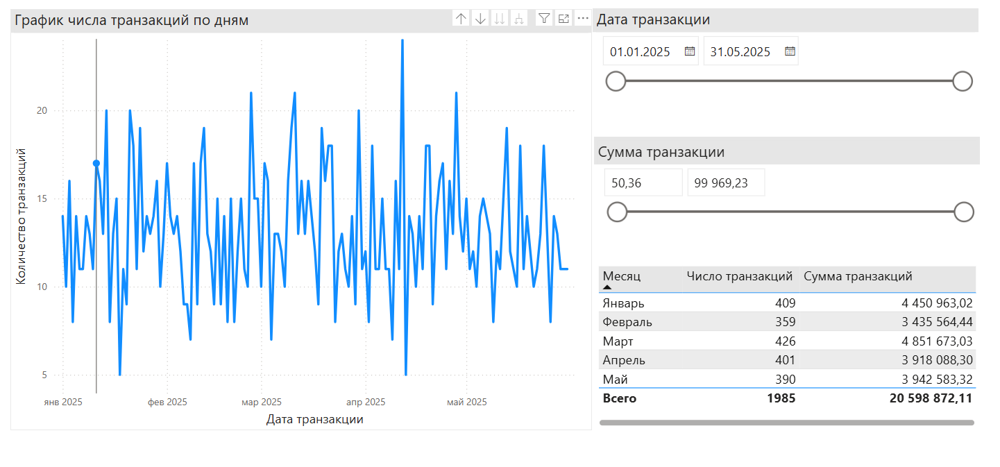

# 📊 Мониторинг транзакций по картам  
**ETL + DWH + BI-дашборд**  

  

## 🔍 О проекте  
Автоматизированная система для:  
- Загрузки транзакций из CSV в базу данных (**ETL**).  
- Хранения данных в оптимизированной структуре (**DWH**).  
- Визуализации статистики в BI-инструменте (**Power BI**).  

**Фичи:**  
✅ Фильтрация транзакций (< 50 ₽ не учитываются)  
✅ Проверка качества данных (тесты на дубликаты, некорректные даты)  
✅ Динамические фильтры в дашборде  

---

- Python 3.10+  
- PostgreSQL 14+  


📂 Project Structure
```text
transaction-monitoring/
├── etl_scripts/                      # Data generate and ETL code
│   ├── create_csv.py
│   ├── csv_to_postgres.py
│   └── generate_transactions.py
├── tests/
│   └── data_testing.py
├── img/                              # Some image
├── docs/                             # Documentation
│   ├── BRD.docx                            
│   └── FSD_personal_project.docx
├── dwh/                             # Database information
│   ├── CREATE_TABLE.sql                            
│   └── dump-card_transactions.sql
├── Transactions_by_day.pbix
├── card_transactions.pptx
├── card_transactions.csv   
└── README.md
```